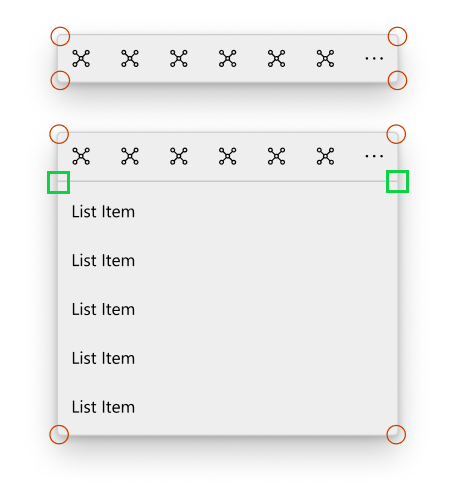

# Background

Xaml controls can have rounded corners, usually controlled by setting the CornerRadius property on [Control](https://docs.microsoft.com/uwp/api/Windows.UI.Xaml.Controls.Control.CornerRadius) or [Border](https://docs.microsoft.com/uwp/api/Windows.UI.Xaml.Controls.Border.CornerRadius). The [CornerRadius](https://docs.microsoft.com/uwp/api/Windows.UI.Xaml.CornerRadius) type itself is a struct with fields TopLeft, TopRight, BottomLeft, and BottomRight.

Typically, a control's ControlTemplate binds the control's CornerRadius to an item in the template, for example this sets the CornerRadius to (5,5,5,5):

```
<Button Background="Gray" Padding="5" CornerRadius="5">
    Click
    <Button.Template>
        <ControlTemplate TargetType="Button">
            <Border Background="{TemplateBinding Background}"
                    CornerRadius="{TemplateBinding CornerRadius}"
                    Padding="{TemplateBinding Padding}">
                <ContentPresenter />
            </Border>
        </ControlTemplate>
    </Button.Template>
</Button>
```

But there are cases where the ControlTemplate needs to get only some of the components out of the CornerRadius struct, for example the top left and right corners, in order to have a rounded top and a square bottom. There's no way to create a TemplateBinding to a struct field, so you can't bind to CornerRadius.TopLeft.

For example when CommandBarFlyout opens up its secondary menu, primary and secondary menus are clipped together we need to clear rounded corners on bottom of primary menu and top of secondary menu to close the gaps.



The solution in this spec is a stock IValueConverter that can be used with the TemplateBinding to extract fields out of the struct.

# Description

CornerRadiusFilterConverter helps us filter CornerRadius values on specific directions and set values to 0 for the rest.

# Examples
A ControlTemplate for a Button that has square bottom corners, and top corners that can be set by the Button.CornerRadius property.
```XAML
<ControlTemplate TargetType="Button">
    <Border Background="{TemplateBinding Background}"
            CornerRadius="{TemplateBinding CornerRadius, Converter={StaticResource CornerRadiusFilterConverter}, ConverterParameter=Top}"
            Padding="{TemplateBinding Padding}">
        <ContentPresenter />
    </Border>
</ControlTemplate>
```

# API Details

```
namespace Microsoft.UI.Xaml.Controls.Primitives
{
    [bindable]
    [webhosthidden]
    [default_interface]
    runtimeclass CornerRadiusFilterConverter : Windows.UI.Xaml.Data.IValueConverter
    {
        CornerRadiusFilterConverter();
    };
}
```

# Remarks

Currently the ConverterParameter only accepts `Top`, `Bottom`, `Left` and `Right`. We can add more specific directions like `TopLeft` and `TopRight` in the future if there's a need.
