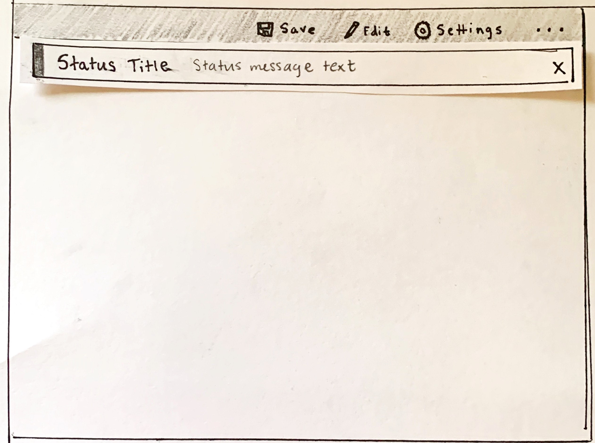
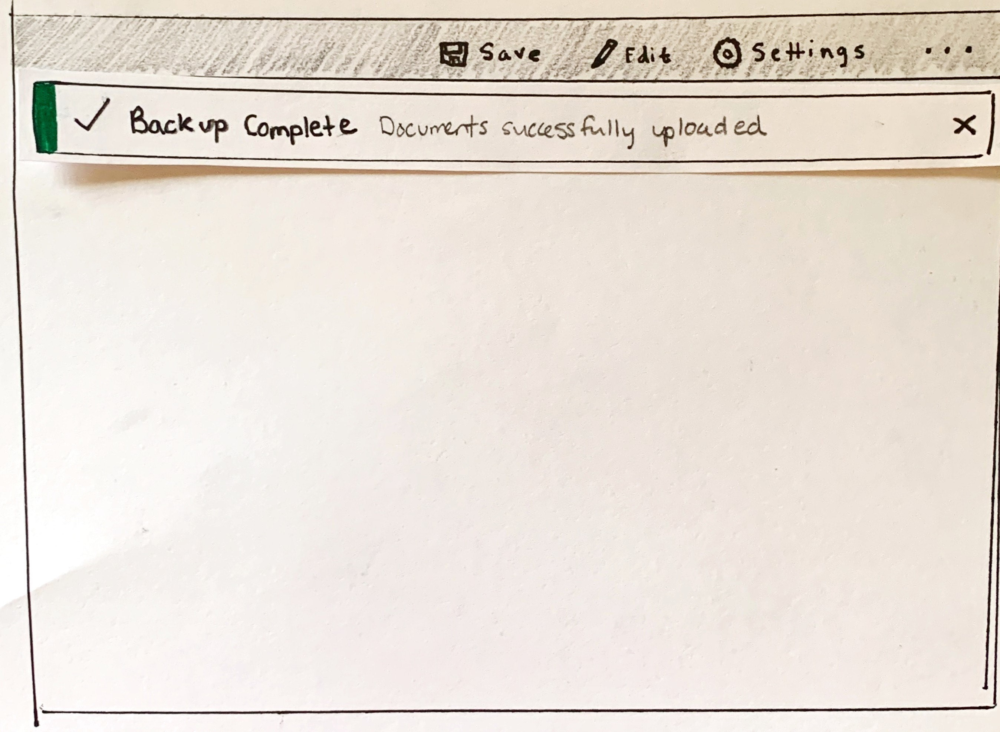
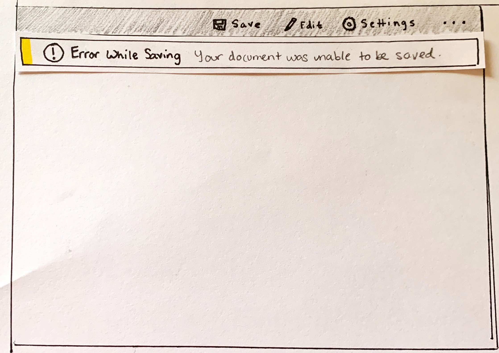
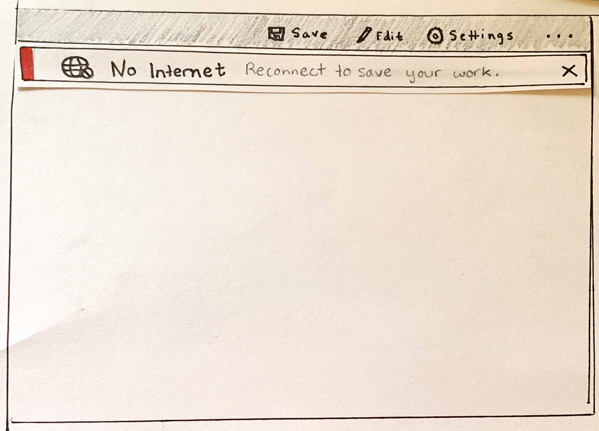
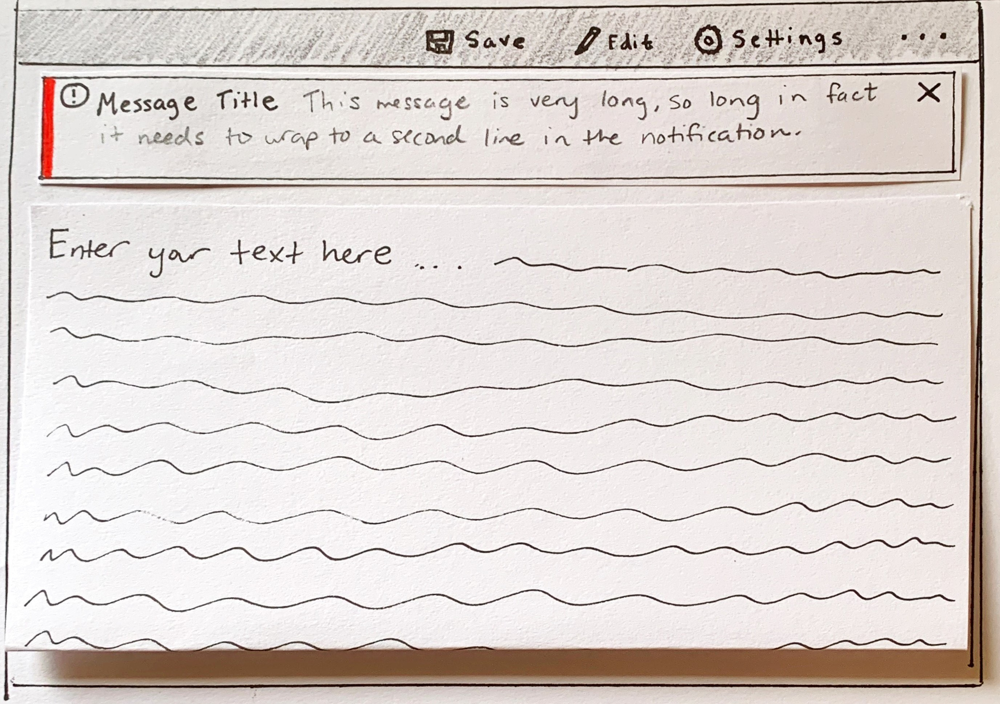
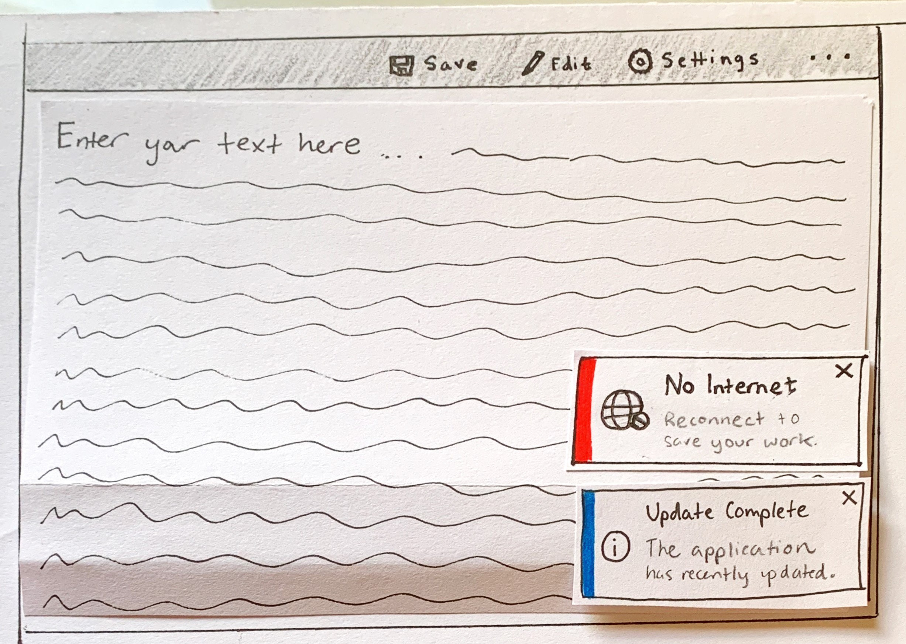
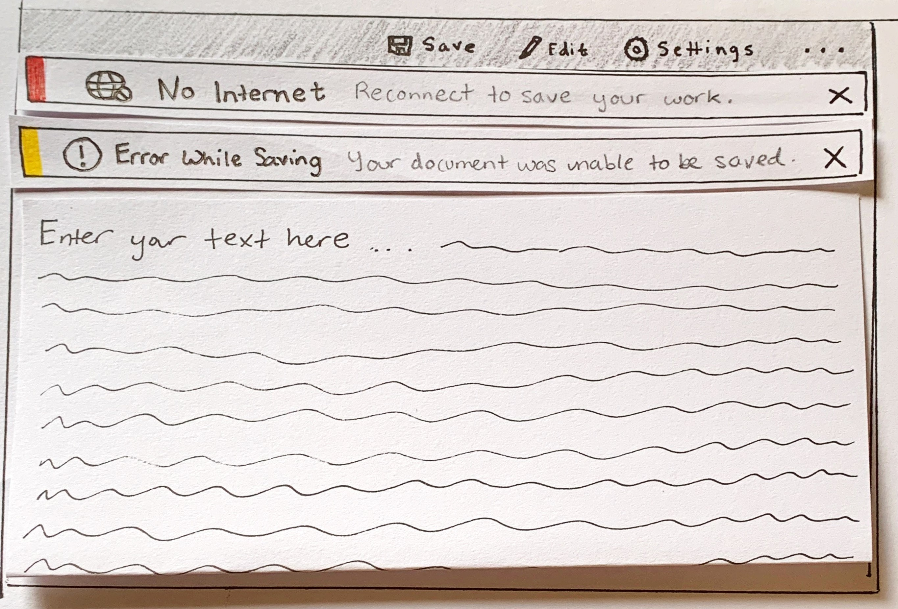
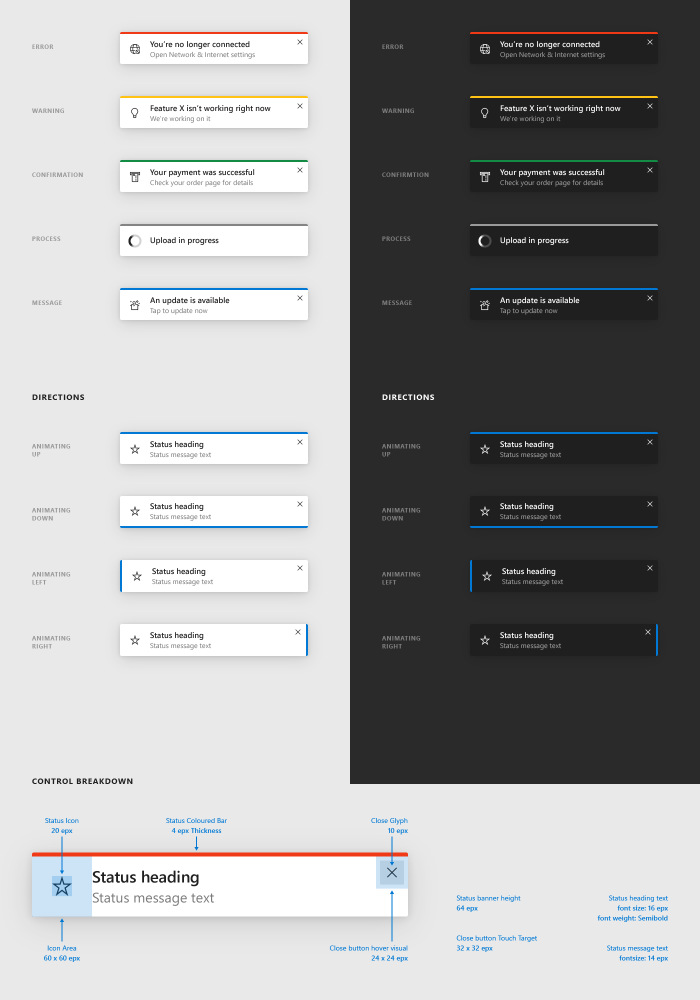
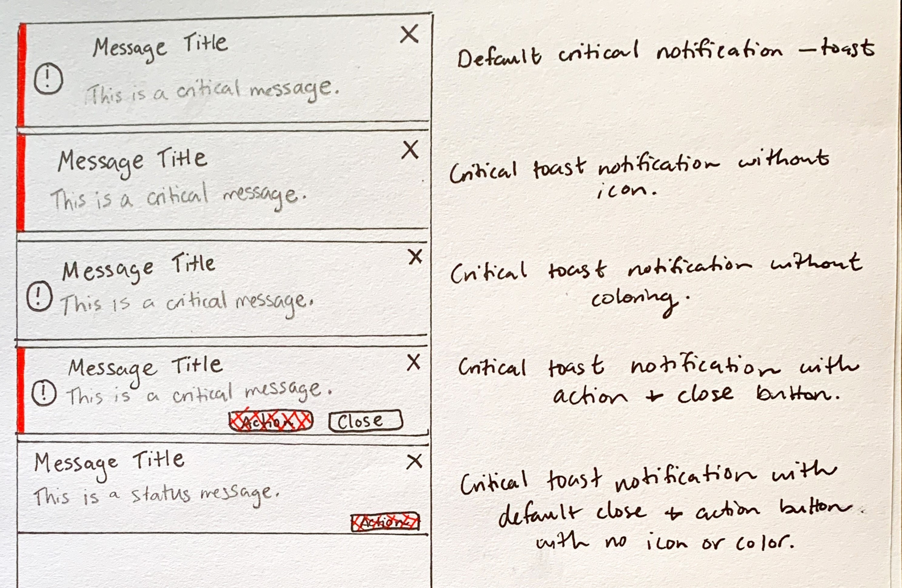

<!-- The purpose of this spec is to describe a new feature and
its APIs that make up a new feature in WinUI. -->

<!-- There are two audiences for the spec. The first are people
that want to evaluate and give feedback on the API, as part of
the submission process.  When it's complete
it will be incorporated into the public documentation at
docs.microsoft.com (http://docs.microsoft.com/uwp/toolkits/winui/).
Hopefully we'll be able to copy it mostly verbatim.
So the second audience is everyone that reads there to learn how
and why to use this API. -->

# Background
> This spec corresponds to [issue 913](https://github.com/microsoft/microsoft-ui-xaml/issues/913) on the WinUI repo.

Users should be informed about essential status changes that occur on an app level.
These status changes affect the app as a whole and can be either critical or informational.
Critical status changes like lost internet connectivity are directly impactful to app functionality while informational status changes like an update has completed and been applied are indirectly impactful to app functionality.
These notifications and corresponding information should be presented in a consistent, predictable, and relevant way to the user depending on the specific scenario.

Currently, Teaching Tip, Content Dialog, and customizations of other flyouts and dialogs exist as options to show these notifications but these controls were not specifically designed to handle app-wide status change notifications. 
Due to their visual layouts, inherent intrusiveness, or available features they are not sufficient for displaying notifications at an app-wide level.


<!-- Use this section to provide background context for the new API(s) 
in this spec. -->

<!-- This section and the appendix are the only sections that likely
do not get copied to docs.microsoft.com; they're just an aid to reading this spec. -->

<!-- If you're modifying an existing API, included a link here to the
existing page(s) -->

<!-- For example, this section is a place to explain why you're adding this API rather than
modifying an existing API. -->

<!-- For example, this is a place to provide a brief explanation of some dependent
area, just explanation enough to understand this new API, rather than telling
the reader "go read 100 pages of background information posted at ...". -->

# Description

An AppNotification is a persistent, actionable, app-wide notification intended for displaying critical or informational status messages that impact app perception or user experience.

## Is this the right control?
Use an AppNotification control when a user needs to be informed of, acknowledge, or take action on a message. By default the notification will remain in the content area until dismissed by the user but will not necessarily break user flow.

Do not use an AppNotification control to confirm or respond directly to a user action, for transient alerts, or for non-essential messages.

### Scenarios
Use an AppNotification that dismiss via the user or when the status is resolved for scenarios that **directly** impact app perception or experience ⚠

- Internet connectivity lost
- Error while saving a document when triggered automatically, not related to specific user action
- No microphone plugged in when attempting to record
- Can't connect to your phone
- The subscription to the application is expired

Use an AppNotification that dismiss via the user or a timer for scenarios that **indirectly** impact app perception or experience ℹ

- A call has begun recording
- Update applied with link to 'Release Notes'
- The terms of service have been updated
- An app-wide backup has successfully, asynchronously completed
- The subscription to the application is close to expiring


<!-- 
Control	| Intrusiveness	|	Information Severity	|	Modality	|	Scope	|	Invocation	|	Dismissal	|	User Action
| -	| -	| -	| -	| -	| -	| -	| -	|
InfoBar ⚠	|	Medium	|	High	|	Non-blocking	|	Global	|	Programmatic	|	Programmatic	|	Acknowledge/View
InfoBar ℹ	|	Medium	|	Medium	|	Non-blocking	|	Global	|	Programmatic	|	Manual	|	Acknowledge/Dismiss -->

### When should a different control be used?

There are some scenarios where a Content Dialog, Flyout, or Teaching Tip may be more appropriate to use.

- For scenarios where a persistent notification is not needed, i.e. displaying information in context of a specific UI element, a [Flyout](https://docs.microsoft.com/en-us/windows/uwp/design/controls-and-patterns/dialogs-and-flyouts/flyouts) is a better option. 
- For scenarios where the application is confirming a user action, showing information the user ***must*** read, use a [Content Dialog](https://docs.microsoft.com/en-us/windows/uwp/design/controls-and-patterns/dialogs-and-flyouts/dialogs).
  - Additionally, if a status change to the app is so severe that it needs to block all further ability for the user to interact with the app, use a Content Dialog.
- For scenarios where the application is informing the user of a new feature or walking through its use, a [Teaching Tip](https://docs.microsoft.com/en-us/windows/uwp/design/controls-and-patterns/dialogs-and-flyouts/teaching-tip) is a better option.

For more info about choosing the right notification control, see the [Dialogs and Flyouts](https://docs.microsoft.com/en-us/windows/uwp/design/controls-and-patterns/dialogs-and-flyouts/) article.
<!-- 
Control |	Intrusiveness |	Information Severity |	Modality |	Scope	Invocation |	Dismissal |	Potential User Action
|- | - | -| -| -| - | - | - |
Content Dialog |	High |	High |	Blocking |	Global |	User-triggered |	Manual |	Interact/Retreat
InfoBar |	Medium |	High/Medium |	Non-blocking |	Global |	Programmatic |	Manual  or Programmatic |	Interact/View
Flyouts |	Medium |	Medium |	Non-blocking |	Contextual |	User-triggered |	Light-dismiss |	Interact/View
Teaching Tip |	Medium |	Low |	Blocking |	Global/Contextual |	User-triggered |	Manual or Light-Dismiss |	Interact/Acknowledge/View
(Toast) |	Low |	Low |	Non-blocking |	Global |	Programmatic or user-triggered |	Timed |	Interact/View -->

<!-- Use this section to provide a brief description of the feature.
For an example, see the introduction to the PasswordBox control 
(http://docs.microsoft.com/windows/uwp/design/controls-and-patterns/password-box). -->

# Examples

<!-- Use this section to explain the features of the API, showing
example code with each description. The general format is: 
  feature explanation,
  example code
  feature explanation,
  example code
  etc.-->
  
<!-- Code samples should be in C# and/or C++/WinRT -->

<!-- As an example of this section, see the Examples section for the PasswordBox control 
(https://docs.microsoft.com/windows/uwp/design/controls-and-patterns/password-box#examples). -->
> Note: In this version of the specification, only a single LayoutMode is implied. In the future, more documentation will be added on a second LayoutMode. The LayoutMode property will change the visual layout of the components, not the functionality. The current LayoutMode shown is "InformationBar", where the components are vertically aligned in a single plane. The second LayoutMode, "Toast", will look more similar to a system notification in it's component layout, details TBD.

An app notification can have several configurations, here are some notable ones.

When an app notification is conveying information of a common criticality, a notification can be set to have one of many NotificationTypes to use consistent Fluent styling for it's identifiers.


If a call to action is needed, an app notification can have customizable action and close buttons.


The app notification can also be customized with XAML Content to include hyperlinks, extra buttons, and other UI elements.


## Create an app notification

The XAML below describes a bar-style app notification with the default styling for a critical notification. An app notification can be created anywhere in the element tree or code behind (Toast TBD). In this example, the notification is located in a ResourceDictionary, expanding to fill the width of the stack panel, like a bar.

XAML
```xml
<StackPanel x:Name="ContentArea" Content="Document">
    <controls:AppNotification x:Name="UnsuccessfulSaveNotification"
        Severity="Warning"
        Title="Error while saving"
        Message="Your document was unable to be saved.">
    </controls:AppNotification>
</StackPanel>
```

C#
```C#
public MainPage()
{
    this.InitializeComponent();

    if(!SaveSuccessful())
    {
        UnsuccessfulSaveNotification.IsOpen = true;
        SetHaveDisplayedErrorNotification();
    }
}
```

Here is the visual representation of the app notification in the page.


<!--## Pop-up app notification 
In some app scenarios, an app-wide bar does not fit for functional or aesthetic reasons. If an app notification is defined independent of another control, the visual layout will default to a to a toast with the same visual components as the aforementioned bar. The app notification will display relative to the edges of the xaml root and by default will be located in the bottom right corner of the application.

XAML
```c#
<StackPanel x:Name="ContentArea" Content="Document" />

<controls:AppNotification x:Name="ConnectionErrorNotification"
    Severity="Critical"
    Icon="NetworkOffline"
    Title="No Internet"
    Message="Reconnect to save your work.">
</controls:AppNotification>
```
[A sketch of a sample application with an app notification as a toast in the bottom right of the content area. The app notification's title is "No Internet" and it's message is "Reconnect to save your work"](images/No_Internet_Toast.png) -->

## Notification types: consistent styling
The type of the app notification can be set via the Severity property to automatically set a consistent status color and icon dependent on the criticality of the notification.

Preset color and icon combos, TBD in collaboration w/ design:
- Critical: Fluent red (#D13438) & ErrorBadge (EEA39)
- Warning: Fluent orange (#FF8C00) & Error (E783)
- Informational: Theme accent or Fluent blue (#0078D7) & Info (E946)
- Success: Fluent green (#107C10) & StatusCircleCheckmark (F13E)
- Default if Severity isn't set: Fluent gray (#6979E) & no icon
- TBD: Should there be a 'None' for no icon or color? How else could that scenario be possible?

TBD: Should these be part of light-weight styling to be set across app? Like data validation? Or separate?

App notification in default styling


App notification in success styling



## Programmatic dismiss in app notification
An app notification can be dismissed by the user via the close button or programmatically. If the notification is required to be in view until the status is resolved and you would like to remove the close button from view, you can set the ShowCloseButton property to false.
By default, the close button will appear as an 'X' and the ShowCloseButton property is therefore set to true.

 > Note: Include a message highlighting the risks with removing a close button. How it can be very intrusive and a back-up removal should be included.

XAML
```xml
<StackPanel x:Name="ContentArea" Content="Document">
    <controls:AppNotification x:Name="UnsuccessfulSaveNotification"
        Severity="Warning"
        Title="Error while saving"
        Message="Your document was unable to be saved."
        ShowCloseButton="False">
    </controls:AppNotification>
</StackPanel>
```


## Custom styling: status color and icon
Outside of the pre-defined notification types, the StatusColor and IconSource properties can be set to customize the styling. 

A color can be set via the StatusColor property with a hex code, i.e. #800000 for maroon. 
TBD: should other color definition methods be supported like RGB? Are there already Fluent aliases for many hex codes?


Alongside color, a custom icon can appear left of the Title and Message in the app notification. If a default styling is chosen, most styles have an associated icon already defined. This icon can be removed or added as a custom icon using the IconSource property. Recommended icon sizes include (TBD)px.

XAML
```xml
<StackPanel x:Name="ContentArea" Content="Document">
    <controls:AppNotification x:Name="ConnectionErrorNotification"
        Title="No Internet"
        Message="Reconnect to save your work.">
        <controls:AppNotification.IconSource>
            <controls:SymbolIconSource Symbol="NetworkOffline" />
        </controls:AppNotification.IconSource>
        <controls:AppNotification.StatusColor>
            <Color x:Key="Maroon">#800000</Color>
        </controls:AppNotification.StatusColor>
    </controls:AppNotification>
</StackPanel>
```




## Add buttons
By default, an 'X' close button will appear as the right most component in the bar. The close button can be customized with the CloseButtonContent property.

An additional action button can be added by setting the ActionButtonContent and ActionButtonCommand properties. Additional action buttons can be added via custom content.
<!-- TODO: add link to custom content header in 'content' -->

XAML
```xml
<StackPanel x:Name="ContentArea" Content="Document">
    <controls:AppNotification x:Name="ConnectionErrorNotification"
        Severity="Critical"
        Title="No Internet"
        Message="Reconnect to save your work."
        ActionButtonContent="Reconnect"
        ActionButtonCommand="RedirectToNetworkSettings"
        CloseButtonContent="Dismiss">
        <controls:AppNotification.IconSource>
            <controls:SymbolIconSource Symbol="NetworkOffline" />
        </controls:AppNotification.IconSource>
    </controls:AppNotification>
</StackPanel>
```


## Custom content
Content can be added to an app notification using the Content property. If there is more content to show than what the size of an app notification will allow, a scrollbar will be automatically enabled to allow a user to scroll the content area.

XAML
```xml
<StackPanel x:Name="ContentArea" Content="Document">
    <controls:AppNotification x:Name="RecentUpdateNotification"
        Severity="Informational"
        Title="Update Complete!"  
            <TextBlock Text="You've been updated to the latest version &#8211;">
                <Hyperlink
                    Content="Notes"
                    NavigateUri="https://www.microsoft.com/app/releasenotes" />
            </TextBlock>
    </controls:AppNotification>
</StackPanel>
```


## Content wrapping
By default, the text set in the Message property will wrap vertically in the control underneath the other visual components. 
If the height of the app notification is explicitly set, a scroll bar (TODO: learn why Teaching Tip is implemented in this way) will be added for users to view the content.

XAML
```xml
<StackPanel x:Name="ContentArea" Content="Document">
    <controls:AppNotification x:Name="DefaultCriticalNotification"
        Severity="Critical"
        Title="Message Title"  
        Message="This message is very long, so long in fact it needs to wrap to a second line in the notification">
    </controls:AppNotification>
</StackPanel>
```



## Multiple app notifications
For applications where multiple notifications may appear on the page at once, there are two main ways they can be displayed; inline or as an overlay.
 - **Overlay**: The notifications will appear on top of other app content, like a pop-up, in a toast visual layout.
 - **Inline**: The notifications will be inline with the other UI elements on the page and push other content if necessary in an app-wide bar visual layout.

### Overlay
However, if multiple app notifications in the Toast mode need to be displayed, developers should use a NotificationHost to handle them. 
A NotificationHost wrapper control (TBD) will handle behavior related to multiple notifications of a specific class on screen at once.
Instead of leaving stacking behavior up to the individual controls, a NotificationHost will manage behavior like:

XAML
```xml
<StackPanel x:Name="ContentArea" Content="Document">
    <controls:NotificationGroup DisplayMode="Overlay">
        <controls:AppNotification x:Name="ConnectionErrorNotification"
            Title="No Internet"
            Message="Reconnect to save your work.">
            <controls:AppNotification.IconSource>
                <controls:SymbolIconSource Symbol="NetworkOffline" />
            </controls:AppNotification.IconSource>
        </controls:AppNotification>
        <controls:AppNotification x:Name="UpdateCompletedNotification"
            Severity="Informational"
            Title="Update complete"
            Message="The application has recently been updated.">
        </controls:AppNotification>
    </controls:NotificationGroup>
</StackPanel>
```



- Positioning in page
- Animation in/out
- Margins between controls
- Stacking order, right to left, top to bottom, etc.


### Inline
To display multiple inline, app-wide InfoBar style notifications, you can manually position your notifications in a layout control as preferred and leave the stacking/positioning behavior up to the default behavior of the parent layout control..

Additionally, you can use the NotificationGroup control with DisplayMode set to "Inline" to manage stacking direction and re-positioning. 
By default, the notifications will stack vertically where the most recent notification will appear at the bottom of the stack. There will be no intro or exit animation.

XAML
```xml
<StackPanel x:Name="ContentArea" Content="Document">
    <controls:NotificationGroup DisplayMode="Inline">
        <controls:AppNotification x:Name="ConnectionErrorNotification"
            Title="No Internet"
            Message="Reconnect to save your work.">
            <controls:AppNotification.IconSource>
                <controls:SymbolIconSource Symbol="NetworkOffline" />
            </controls:AppNotification.IconSource>
        </controls:AppNotification>
        <controls:AppNotification x:Name="UnsuccessfulSaveNotification"
            Severity="Warning"
            Title="Error while saving"
            Message="Your document was unable to be saved.">
        </controls:AppNotification>
    </controls:NotificationGroup>
</StackPanel>
```




## Updating an app notification
TBD: define updating behavior, should this exist?
- What properties can be updated?
- Is there an animation to occur?
- How is dismissal handled?

## Canceling and deferring close
TBD: define event behavior, similar to TeachingTip?

## What mode of app notification should I use?
TBD after the first (InfoBar) mode is mostly defined.

# Inputs and Accessibility
## UI Automation patterns
TBD?

## Keyboard Navigation
TBD

## Narrator
TBD

## Gamepad
TBD

# Remarks
## Recommendations
TBD
- Dark mode guidances
- Conveying meaning via color AND icon for accessibility

When to show an app notification?

Current opinion: When the state of the application is different from normal, expected functionality
- Patterns for critical notifications (i.e. internet connectivity is required for the application to function)
    - A critical app notification should remain in view until the connection is restored if the app's functionality is very limited without this feature working.
    - A critical app notification appears ("Internet connectivity lost") and can be dismissed by the user.
        - However, if the internet is reconnected and the user had previously dismissed the notification, the notification should update to "Internet is reconnected" Success notification to inform the user the functionality of the application is restored.
        - Additionally, if the internet is reconnected and the notification is still on the screen, the notification should merely disappear from view.
    
- Patterns for informational notifications, users should **always** have the option to dismiss informational notifications, even if they are intended to disappear after # seconds. 
    - If the app is performing a long task in the background that can then require further user action (i.e. backing up a drive or scanning for viruses) then an app notification for "Success" could appear.
    - TBD: App update recommendations
## Anti-patterns
TBD
- Is there a limit to how often an app notification can appear/disappear from view?
  - Prevent "flashing" notification bars
- Only *one* app notification should appear for every scenario 
<!-- Explanation and guidance that doesn't fit into the Examples section. -->

<!-- APIs should only throw exceptions in exceptional conditions; basically,
only when there's a bug in the caller, such as argument exception.  But if for some
reason it's necessary for a caller to catch an exception from an API, call that
out with an explanation either here or in the Examples -->

# API Notes
<!-- Option 1: Give a one or two line description of each API (type
and member), or at least the ones that aren't obvious
from their name.  These descriptions are what show up
in IntelliSense. For properties, specify the default value of the property if it
isn't the type's default (for example an int-typed property that doesn't default to zero.) -->

<!-- Option 2: Put these descriptions in the below API Details section,
with a "///" comment above the member or type. -->

### Notable Properties  

| Name | Description |
|:-:|:--|
| Severity | Gets or sets a value that indicates the  color and icon to style the app notification |
| ShowCloseButton| Gets or sets a boolean that indicates whether a close button will appear


### Events    
TBD: Same as Teaching Tip at the moment
| Name | Description |
|:-:|:--|
| ActionButtonClick | Occurs after the action button has been tapped. |
| CloseButtonClick | Occurs after the close button has been tapped. |
| Closed | Occurs after the app notification is closed. |
| Closing |Occurs just before the app notification begins to close. |

# Detailed Design

TBD: Include screenshots of specific designs as the next iteration after the paper mockups.
Includes specifics like:

- Default sizing of notifications (px)
- Exact colors for the different severity levels
- Exact width of color area (px)
- Margins, padding, etc.
- Text info; font, color, boldness, etc.

# API Details
<!-- The exact API, in MIDL3 format (https://docs.microsoft.com/en-us/uwp/midl-3/) -->
```c++
// TODO: investigate and develop
enum AppNotificationCloseReason
{
    CloseButton,
    Programmatic,
};

enum NotificationType
{
    Critical,
    Warning,
    Informational,
    Success,
}

runtimeclass AppNotificationClosedEventArgs
{
    AppNotificationCloseReason Reason{ get; };
};

runtimeclass AppNotificationClosingEventArgs
{
    AppNotificationCloseReason Reason{ get; };
    Boolean Cancel;
    Windows.Foundation.Deferral GetDeferral();
};

// TODO: is there anything else needed in TemplateSettings?
unsealed runtimeclass AppNotificationTemplateSettings : Windows.UI.Xaml.DependencyObject
{
    AppNotificationTemplateSettings();

    // TODO: what do these highlight margins define?
    Windows.UI.Xaml.Thickness TopRightHighlightMargin;
    Windows.UI.Xaml.Thickness TopLeftHighlightMargin;

    Windows.UI.Xaml.Controls.IconElement IconElement;

    static Windows.UI.Xaml.DependencyProperty TopRightHighlightMarginProperty{ get; };
    static Windows.UI.Xaml.DependencyProperty TopLeftHighlightMarginProperty{ get; };
    static Windows.UI.Xaml.DependencyProperty IconElementProperty{ get; };
}

unsealed runtimeclass AppNotification : Windows.UI.Xaml.Controls.ContentControl
{
    AppNotification();

    String Title;
    String Message;

    Boolean IsOpen;
    Boolean ShowCloseButton;

    Object ActionButtonContent;
    Windows.UI.Xaml.Style ActionButtonStyle;
    Windows.UI.Xaml.Input.ICommand ActionButtonCommand;
    Object ActionButtonCommandParameter;

    Object CloseButtonContent;
    Windows.UI.Xaml.Style CloseButtonStyle;
    Windows.UI.Xaml.Input.ICommand CloseButtonCommand;
    Object CloseButtonCommandParameter;

    NotificationType Severity;
    Color StatusColor;
    IconSource IconSource;

    AppNotificationTemplateSettings TemplateSettings{ get; };

    event Windows.Foundation.TypedEventHandler<AppNotification, Object> ActionButtonClick;
    event Windows.Foundation.TypedEventHandler<AppNotification, Object> CloseButtonClick;
    event Windows.Foundation.TypedEventHandler<AppNotification, AppNotificationClosingEventArgs> Closing;
    event Windows.Foundation.TypedEventHandler<AppNotification, AppNotificationClosedEventArgs> Closed;

    static Windows.UI.Xaml.DependencyProperty IsOpenProperty{ get; };

    static Windows.UI.Xaml.DependencyProperty TitleProperty{ get; };
    static Windows.UI.Xaml.DependencyProperty MessageProperty{ get; };

    static Windows.UI.Xaml.DependencyProperty ActionButtonContentProperty{ get; };
    static Windows.UI.Xaml.DependencyProperty ActionButtonStyleProperty{ get; };
    static Windows.UI.Xaml.DependencyProperty ActionButtonCommandProperty{ get; };
    static Windows.UI.Xaml.DependencyProperty ActionButtonCommandParameterProperty{ get; };

    static Windows.UI.Xaml.DependencyProperty CloseButtonContentProperty{ get; };
    static Windows.UI.Xaml.DependencyProperty CloseButtonStyleProperty{ get; };
    static Windows.UI.Xaml.DependencyProperty CloseButtonCommandProperty{ get; };
    static Windows.UI.Xaml.DependencyProperty CloseButtonCommandParameterProperty{ get; };

    static Windows.UI.Xaml.DependencyProperty NotificationTypeProperty{ get; };
    static Windows.UI.Xaml.DependencyProperty StatusColorProperty{ get; };
    static Windows.UI.Xaml.DependencyProperty IconSourceProperty{ get; };

    static Windows.UI.Xaml.DependencyProperty TemplateSettingsProperty{ get; };
}
```
# Appendix
<!-- Anything else that you want to write down for posterity, but 
that isn't necessary to understand the purpose and usage of the API.
For example, implementation details. -->
### Design References

InfoBar wrapping examples


Toast mockups and animations from @mdtauk

[Status Banner Animate In](https://youtu.be/De_hIhy5FnI)

[Status Banner Enter, Update, Exit](https://www.youtube.com/watch?v=cGTtDNjTyq4)


Toast layout examples



### Visual Components

 | Component |  Notes |
|:---:|:---|
| Container | - Specific details TBD
| Title | - Semi-bolded <br> - Recommended to be 50 characters or less
| Message | - Text wrapping behavior TBD <br> - Recommended to be 512 characters or less 
| StatusColor | - Defined by either the Severity or by setting a custom Color
| Icon | - Defined by either the Severity or by IconSource <br>
| Close button | - Will appear as 'X' by default <br> - Can be customized as a button <br> - Can be removed via IsProgrammaticDismissal
| Action button | - Optional <br> - Additional action buttons may be added through custom XAML content in the Message
| Content | - Can be customizable to include text, hyperlinks, and any other XAML content <br> - Appears between the Title/Message and any Action or Close buttons

## Behavioral Components
 | Property | Notes |
|:---:|:---|
| Opening | * an app notification is shown by setting its IsOpen property to true. <br> * App notifications will animate on opening. <br> * When an app notification does not have enough available window space to fully show in any location [see Placement], it will not open and will instead overwrite IsOpen to false. |
| Closing | There are two ways an app notification can close: The program sets the IsOpen property to false, the user invokes the Close button. Use the AppNotificationCloseReason to determine which case has occurred. Closing can be prevented by setting the Cancel property to true. You can use a deferral to respond asynchronously to the event. |
| Motion | * App notifications have built in open and close animations that can be customizable using Storyboards.|

## Data and Intelligence Metrics
Recommendations from ryandemo:
- How many buttons included correlated to criticality of status message
- Track popularity of each layout mode
- Average length of time the notifications display on screen until dismissal, correlated to criticality
- How often color and/or icon customization Occurs
- How often multiple app notifications appear at once and the typical distribution