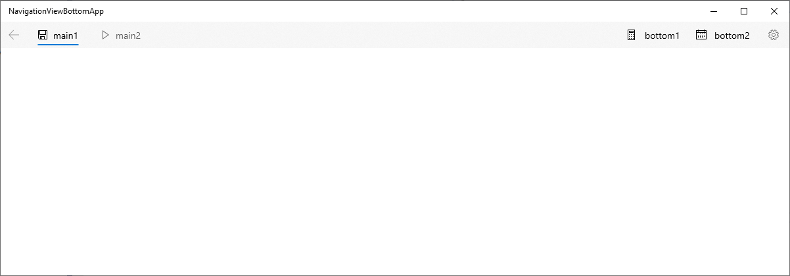

# Background
Today, [NavigationView](https://docs.microsoft.com/en-us/windows/uwp/design/controls-and-patterns/navigationview) provides a place in its [Pane](https://docs.microsoft.com/en-us/windows/uwp/design/controls-and-patterns/navigationview) to show any number of items.
The primary purpose of these items is to be a list of navigation links within the app that hosts NavigationView, likely as a root element.
This navigation list is top aligned when NavigationView is shown in one of its left [display modes](https://docs.microsoft.com/en-us/windows/uwp/design/controls-and-patterns/navigationview#display-modes), and left aligned when NavigationView is in its top [display mode](https://docs.microsoft.com/en-us/windows/uwp/design/controls-and-patterns/navigationview#display-modes).
NavigationView provides a built-in [Settings item](https://docs.microsoft.com/en-us/uwp/api/microsoft.ui.xaml.controls.navigationview.settingsitem?view=winui-2.3), which is always positioned at the bottom or right of the Pane, and a [PaneFooter](https://docs.microsoft.com/en-us/uwp/api/microsoft.ui.xaml.controls.navigationview.panefooter?view=winui-2.3) area that positions content just before (either above or to the left) of the Settings item.
Although an app developer can place any content into PaneFooter, including other NavigationViewItems, this content will not participate in the selection model and animations of the primary navigation list and Settings item.

_Open question:_ Should PaneFooter be deprecated because this new API is a direct replacement?

# Description
<!-- Use this section to provide a brief description of the feature.
For an example, see the introduction to the PasswordBox control 
(http://docs.microsoft.com/windows/uwp/design/controls-and-patterns/password-box). -->
Some apps may choose to visually group navigation items into top-aligned and bottom-aligned lists.
While this grouping is possible today using navigation view's [PaneFooter](https://docs.microsoft.com/en-us/uwp/api/microsoft.ui.xaml.controls.navigationview.panefooter?view=winui-2.3) property, the approach has interaction downsides that this feature will correct.




By adding FooterMenuItems, we'll unify the [Settings item](https://docs.microsoft.com/en-us/uwp/api/microsoft.ui.xaml.controls.navigationview.settingsitem?view=winui-2.3) with other navigation items in its immediate proximity.
As a result, keyboard and Narrator users will feel that the footer list behavior meets their expectations.
Selection behavior and animations will also feel better integrated into the whole NavigationView control.


# Examples
<!-- Use this section to explain the features of the API, showing
example code with each description. The general format is: 
  feature explanation,
  example code
  feature explanation,
  example code
  etc.-->
  
<!-- Code samples should be in C# and/or C++/WinRT -->

<!-- As an example of this section, see the Examples section for the PasswordBox control 
(https://docs.microsoft.com/windows/uwp/design/controls-and-patterns/password-box#examples). -->

## Add footer menu items in markup
```xaml
    <muxc:NavigationView>
        <muxc:NavigationView.MenuItems>
            <muxc:NavigationViewItem Icon="Save" Content="main1"/>
            <muxc:NavigationViewItem Icon="Play" Content="main2"/>
        </muxc:NavigationView.MenuItems>
        <muxc:NavigationView.FooterMenuItems>
            <muxc:NavigationViewItem Icon="Calculator" Content="bottom1" Padding="0,0,12,0"/>
            <muxc:NavigationViewItem Icon="Calendar" Content="bottom2" Padding="0,0,12,0"/>
        </muxc:NavigationView.FooterMenuItems>
        
    </muxc:NavigationView>
```


# Remarks
<!-- Explanation and guidance that doesn't fit into the Examples section. -->

<!-- APIs should only throw exceptions in exceptional conditions; basically,
only when there's a bug in the caller, such as argument exception.  But if for some
reason it's necessary for a caller to catch an exception from an API, call that
out with an explanation either here or in the Examples -->

FooterMenuItems is a list of navigation items similar to the existing MenuItems list.
The default Settings item will be included as the last item in the FooterMenuItems collection.
As a result, adding items into FooterMenuItems will have the following default behavior.

## Selection
When users invoke a navigation item, that item will become selected and show its selection indicator. 
At most one navigation item will be selected at a given time.
The selection indicator will animate smoothly between items in the MenuItems list and FooterMenuItems list including Settings.

## Narrator
Screen readers will announce MenuItems and FooterMenuItems as two separate lists, including position in set.

## Keyboarding


# API Notes
<!-- Option 1: Give a one or two line description of each API (type
and member), or at least the ones that aren't obvious
from their name.  These descriptions are what show up
in IntelliSense. For properties, specify the default value of the property if it
isn't the type's default (for example an int-typed property that doesn't default to zero.) -->

<!-- Option 2: Put these descriptions in the below API Details section,
with a "///" comment above the member or type. -->

# API Details
<!-- The exact API, in MIDL3 format (https://docs.microsoft.com/en-us/uwp/midl-3/) -->
```c++
[WUXC_VERSION_RS3]
[webhosthidden]
[WUXC_INTERFACE_NAME("INavigationView", f209ce15-391a-42ca-9fc6-f79da65aca32)]
[WUXC_STATIC_NAME("INavigationViewStatics", 363a86c7-72da-4420-b871-15d9d0d45756)]
[WUXC_CONSTRUCTOR_NAME("INavigationViewFactory", e50687c1-b7c2-4975-ad7a-5f4fe6a514c9)]
[MUX_PROPERTY_CHANGED_CALLBACK(TRUE)]
[MUX_PROPERTY_CHANGED_CALLBACK_METHODNAME("OnPropertyChanged")]
unsealed runtimeclass NavigationView : Windows.UI.Xaml.Controls.ContentControl
{

    [WUXC_VERSION_PREVIEW]
    {
        Windows.Foundation.Collections.IVector<Object> FooterMenuItems{ get; };
    }
    
    static Windows.UI.Xaml.DependencyProperty FooterMenuItemsProperty{ get; };
    
}
```

# Appendix
<!-- Anything else that you want to write down for posterity, but 
that isn't necessary to understand the purpose and usage of the API.
For example, implementation details. -->
