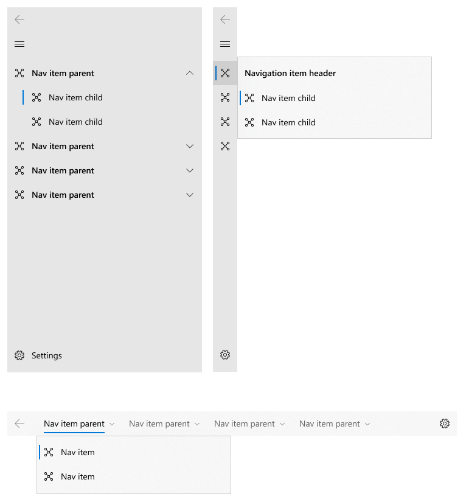

# Background
Currently, NavigationView's MenuItems list allows for displaying a flat list of items in the pane. 
It's common for apps to want to present users with a hierarchical navigation tree. 
This feature adds the capability to nest items within the pane. 


# Hierarchy
To show a hierarchical list of nested navigation items in the pane, use NavigationViewItem's `MenuItems` property.
Each *NavigationViewItem* can contain other NavigationViewItems and organizing elements like item headers and separators. 
Although NavigationViewItem can contain any number of nested levels, we recommend keeping your app’s navigation hierarchy shallow. 
We believe two levels is ideal for usability and comprehension.

NavigationView shows hierarchy in all its pane display modes, including Top and LeftCompact.



# Examples

## Add items in markup
Declare app navigation hierarchy in markup.

```Xaml
<muxc:NavigationView>
    <muxc:NavigationView.MenuItems>
        <muxc:NavigationViewItem Content="Home" Icon="Home" ToolTipService.ToolTip="Home"/>
        <muxc:NavigationViewItem Content="Collections" 
                            Icon="Keyboard" ToolTipService.ToolTip="Collections">
            <muxc:NavigationViewItem.MenuItems>
                <muxc:NavigationViewItem Content="Bookshelf" 
                                Icon="Library" ToolTipService.ToolTip="Bookshelf"/>
                <muxc:NavigationViewItem Content="Mail" 
                                Icon="Mail" ToolTipService.ToolTip="Mail"/>
            </muxc:NavigationViewItem.MenuItems>
        </muxc:NavigationViewItem>
    </muxc:NavigationView.MenuItems>
</muxc:NavigationView>
```

## Add items using data binding


# Remarks
<!-- Explanation and guidance that doesn't fit into the Examples
section.  For example, see the Remarks for the MediaPlayerElement 
(https://docs.microsoft.com/uwp/api/Windows.UI.Xaml.Controls.MediaPlayerElement#remarks). -->


# API Notes
<!-- Give a one or two line description of each API (type
and member), or at least the ones that aren't obvious
from their name.  These descriptions are what show up
in IntelliSense. -->


# API Details
```c++
[WUXC_VERSION_PREVIEW]
[webhosthidden]
runtimeclass NavigationViewExpandingEventArgs
{
    NavigationViewItemBase ExpandingItemContainer { get; };
}

[WUXC_VERSION_PREVIEW]
[webhosthidden]
runtimeclass NavigationViewCollapsedEventArgs
{
    NavigationViewItemBase CollapsedItemContainer { get; };
}

[WUXC_VERSION_RS3]
[webhosthidden]
[WUXC_INTERFACE_NAME("INavigationView", f209ce15-391a-42ca-9fc6-f79da65aca32)]
[WUXC_STATIC_NAME("INavigationViewStatics", 363a86c7-72da-4420-b871-15d9d0d45756)]
[WUXC_CONSTRUCTOR_NAME("INavigationViewFactory", e50687c1-b7c2-4975-ad7a-5f4fe6a514c9)]
[MUX_PROPERTY_CHANGED_CALLBACK(TRUE)]
[MUX_PROPERTY_CHANGED_CALLBACK_METHODNAME("OnPropertyChanged")]
unsealed runtimeclass NavigationView : Windows.UI.Xaml.Controls.ContentControl
{
...
    [WUXC_VERSION_PREVIEW]
    {
        event Windows.Foundation.TypedEventHandler<NavigationView, NavigationViewExpandingEventArgs> Expanding;
        event Windows.Foundation.TypedEventHandler<NavigationView, NavigationViewCollapsedEventArgs> Collapsed;

        void Expand(NavigationViewItem item);
        void Collapse(NavigationViewItem item);
    }
}

[WUXC_VERSION_RS3]
[webhosthidden]
[WUXC_INTERFACE_NAME("INavigationViewItemBase", edf04eb1-37d1-471f-8570-3829ee5b2bc6)]
[WUXC_CONSTRUCTOR_NAME("INavigationViewItemBaseFactory", eb014cef-7890-4ebb-8245-02e8510f321d)]
[default_interface]
unsealed runtimeclass NavigationViewItemBase : Windows.UI.Xaml.Controls.ContentControl
{
    [WUXC_VERSION_PREVIEW]
    {
        Boolean IsSelected{ get; set; };
        static Windows.UI.Xaml.DependencyProperty IsSelectedProperty { get; };
    }
}

[WUXC_VERSION_RS3]
[webhosthidden]
[WUXC_INTERFACE_NAME("INavigationViewItem", 8614be0f-b7b6-4851-960a-f5e3f69f624a)]
[WUXC_STATIC_NAME("INavigationViewItemStatics", 803c0081-fda5-4b90-aace-3f2306dbe5c4)]
[WUXC_CONSTRUCTOR_NAME("INavigationViewItemFactory", 973bdb4a-7e08-4f76-923c-f12bd685e86e)]
unsealed runtimeclass NavigationViewItem : NavigationViewItemBase
{
...
    [WUXC_VERSION_PREVIEW]
    {
        [MUX_DEFAULT_VALUE("false")]
        Boolean IsExpanded{ get; set; };
        [MUX_DEFAULT_VALUE("false")]
        Boolean HasUnrealizedChildren{ get; set; };
        [MUX_DEFAULT_VALUE("false")]
        Boolean IsChildSelected{ get; set; };

        [MUX_PROPERTY_CHANGED_CALLBACK(TRUE)]
        Windows.Foundation.Collections.IVector<Object> MenuItems{ get; };
        [MUX_PROPERTY_CHANGED_CALLBACK(TRUE)]
        Object MenuItemsSource{ get; set; };

        static Windows.UI.Xaml.DependencyProperty IsExpandedProperty{ get; };
        static Windows.UI.Xaml.DependencyProperty HasUnrealizedChildrenProperty{ get; };
        static Windows.UI.Xaml.DependencyProperty IsChildSelectedProperty{ get; };
        static Windows.UI.Xaml.DependencyProperty MenuItemsProperty{ get; };
        static Windows.UI.Xaml.DependencyProperty MenuItemsSourceProperty{ get; };
    }
}

```

# Appendix
<!-- Anything else that you want to write down for posterity, but 
that isn't necessary to understand the purpose and usage of the API.
For example, implementation details. -->
