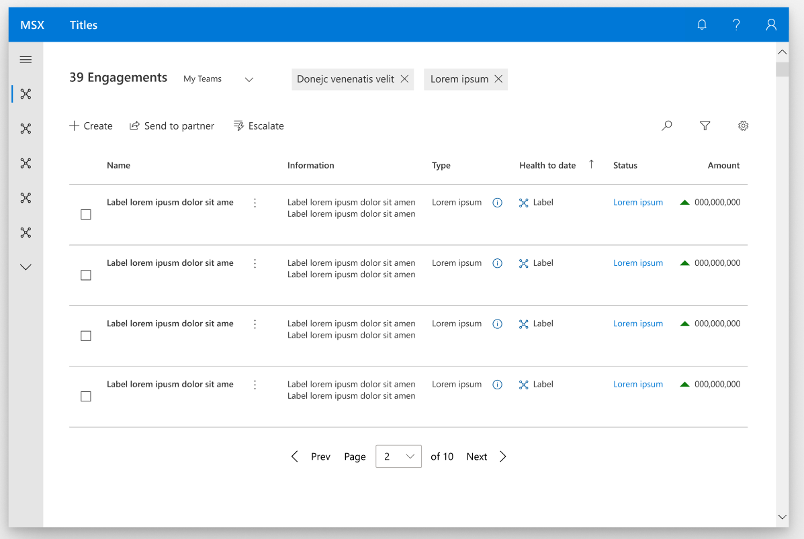
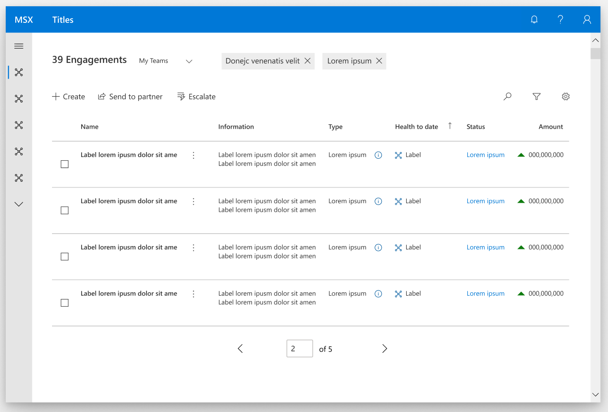

# Pager control

<!-- The purpose of this spec is to describe a new feature and
its APIs that make up a new feature in WinUI. -->

<!-- There are two audiences for the spec. The first are people
that want to evaluate and give feedback on the API, as part of
the submission process.  When it's complete
it will be incorporated into the public documentation at
docs.microsoft.com (http://docs.microsoft.com/uwp/toolkits/winui/).
Hopefully we'll be able to copy it mostly verbatim.
So the second audience is everyone that reads there to learn how
and why to use this API. -->

## Background
<!-- Use this section to provide background context for the new API(s) 
in this spec. -->

<!-- This section and the appendix are the only sections that likely
do not get copied to docs.microsoft.com; they're just an aid to reading this spec. -->

<!-- If you're modifying an existing API, included a link here to the
existing page(s) -->

<!-- For example, this section is a place to explain why you're adding this API rather than
modifying an existing API. -->

<!-- For example, this is a place to provide a brief explanation of some dependent
area, just explanation enough to understand this new API, rather than telling
the reader "go read 100 pages of background information posted at ...". -->

The absence of a standard UI pager control, last seen as DataPager in Silverlight, has been a pain point in both WPF and UWP that has forced a variety of unfavorable workarounds for developers. Inclusion of this control in UWP would resolve an ecosystem gap and enable developers to efficiently deliver UI paging experiences in their applications. Through XAML Islands, it may also provide an opportunity to benefit WPF developers working with DataGrid or ListView. The scope of this proposal is not provide a data paging solution at this time but to start with UI paging as a foundation on top of which data paging may be later integrated.


## Description
<!-- Use this section to provide a brief description of the feature.
For an example, see the introduction to the PasswordBox control 
(http://docs.microsoft.com/windows/uwp/design/controls-and-patterns/password-box). -->

Pager control is a customizable pager UI widget with generic events that can be configured to navigate pages for several view controls.

**Important APIs:** [PagerControl class](https://docs.microsoft.com/en-us/uwp/api/microsoft.ui.xaml.controls.pagercontrol)

Pager control can be configured to use a ComboBox, editable NumberBox, or numeric Button panel as the core pager control.

## Is this the right control? 

Use a **PagerControl** to create an accessible navigation interface for views that have multiple pages to display.

## Examples
<!-- Use this section to explain the features of the API, showing
example code with each description. The general format is: 
  feature explanation,
  example code
  feature explanation,
  example code
  etc.-->
  
<!-- Code samples should be in C# and/or C++/WinRT -->

<!-- As an example of this section, see the Examples section for the PasswordBox control 
(https://docs.microsoft.com/windows/uwp/design/controls-and-patterns/password-box#examples). -->

A pager control can have several configurations, including these notable ones.

### ComboBox Pager Control



XAML
```XAML
<GridView x:Name="gridView1" ... />
    <controls:PagerControl x:Name="MainPagerControl"
        DisplayMode="ComboBox"
	NumberOfPages="10"
        FirstButtonVisibility="None"
        PreviousButtonVisibility="AlwaysVisible"
        PreviousButtonText="Prev"
        NextButtonVisibility="AlwaysVisible"
        NextButtonText="Next"
        LastButtonVisibility="None"
	FirstButtonCommand="FirstButtonPressedEvent"
        PreviousButtonCommand="PreviousButtonPressedEvent"
        NextButtonCommand="NextButtonPressedEvent"
        LastButtonCommand="LastButtonPressedEvent"
        PagerInputCommand="PagerInputEvent"
	Prefix="Page"
	Suffix="of 10"/>
</Grid>
```

### Numerical Button Panel Pager Control


XAML
```XAML
<GridView x:Name="gridView1" ... />
    <controls:PagerControl x:Name="MainPagerControl"
        DisplayMode="NumericalButtonPanel"
	NumberOfPages="10"
        FirstButtonVisibility="AlwaysVisible"
        PreviousButtonVisibility="AlwaysVisible"
        NextButtonVisibility="AlwaysVisible"
        LastButtonVisibility="AlwaysVisible"
        FirstButtonCommand="FirstButtonPressedEvent"
        PreviousButtonCommand="PreviousButtonPressedEvent"
        NextButtonCommand="NextButtonPressedEvent"
        LastButtonCommand="LastButtonPressedEvent"
        PagerInputCommand="PagerInputEvent"
        EllipsisEnabled="True"
	EllipsisShowFirstAndLast="True"
        NumberOfIndicesShowing="6"
	EllipsisMaxBefore="5"
	EllipsisMaxAfter="1"/>
</Grid>
```

### Editable NumberBox Pager Control



XAML
```XAML
<GridView x:Name="gridView1" ... />
    <controls:PagerControl x:Name="MainPagerControl"
        DisplayMode="NumberBox"
        NumberOfPages="5"
	FirstButtonVisibility="None"
        PreviousButtonVisibility="AlwaysVisible"
        NextButtonVisibility="AlwaysVisible"
        LastButtonVisibility="None"
	FirstButtonCommand="FirstButtonPressedEvent"
        PreviousButtonCommand="PreviousButtonPressedEvent"
        NextButtonCommand="NextButtonPressedEvent"
        LastButtonCommand="LastButtonPressedEvent"
        PagerInputCommand="PagerInputEvent"
	Suffix="of 5"/>
</Grid>
```

## Adding a PagerControl to Your Application

Here is the XAML to show how to add the PagerControl to your application. It can be added on the page as shown below, or can be used in the template of the layout view you prefer to use. PagerControl is added to the template for DataGrid and ItemsRepeater in WinUI 2.x and will be added to ListView and GridView in WinUI 3. 


## Remarks
<!-- Explanation and guidance that doesn't fit into the Examples section. -->

<!-- APIs should only throw exceptions in exceptional conditions; basically,
only when there's a bug in the caller, such as argument exception.  But if for some
reason it's necessary for a caller to catch an exception from an API, call that
out with an explanation either here or in the Examples -->

## API Notes
<!-- Option 1: Give a one or two line description of each API (type
and member), or at least the ones that aren't obvious
from their name.  These descriptions are what show up
in IntelliSense. For properties, specify the default value of the property if it
isn't the type's default (for example an int-typed property that doesn't default to zero.) -->

<!-- Option 2: Put these descriptions in the below API Details section,
with a "///" comment above the member or type. -->

### Visual Components

 | Component |  Notes |
|:---:|:---|
| DisplayMode | * Used to set either a button panel (default) or an editable ComboBox as the indexing component. <br> * When set to be a button panel, the number of visible indices can be specified. <br><br>  &nbsp;&nbsp;&nbsp;&nbsp;&nbsp;&nbsp;&nbsp;&nbsp;  |
| LastButton | * Button displaying text and/or glyph indicating that the user may navigate to the last index. <br> * Automatically disabled when at last index. <br> * Can be set to not be visible when at the last index.  <br><br>  |
| FirstButton | * Button displaying text and/or glyph indicating that the user may navigate to the first index. <br> * Automatically disabled when at first index. <br> * Can be set to not be visible when at the first index.  <br><br>  |
| NextButton | * Button displaying text and/or glyph indicating that the user may navigate to the next index. <br> * Automatically disabled when at last index. <br> * Can be set to not be visible when at the last index. <br><br>  |
| PreviousButton | * Button displaying text and/or glyph indicating that the user may navigate to the previous index. <br> * Automatically disabled when at first index. <br> * Can be set to not be visible when at the first index.  <br><br>  |
| Ellipsis | * Button, often reading "...", used between indexes and before or after the first/last index to indicate an accessible but omitted range of indexes. <br> * MaxBefore and MaxAfter properties can be used to set  how many indices appear between the current page and the ellipsis before/after it. <br> * Visibility of the first/last index can be disabled. <br> * Only visible when using button panel as the display mode.  <br><br>  |
| PrefixText | * Text displayed before the editable ComboBox indexing component. <br><br>  |
| NumberOfPages | * When a total number of indices (N) is given, this suffix string will appear after the editable ComboBox indexing component and read "of N". Localization will put "N" where it should be in a given language. <br><br>  |

## API Details
<!-- The exact API, in MIDL3 format (https://docs.microsoft.com/en-us/uwp/midl-3/) -->

```c++ 
enum PagerDisplayMode
{
    Auto,
    ComboBox,
    NumberBox,
    ButtonPanel,
};


enum ButtonVisibilityMode
{
    Auto,
    AlwaysVisible,
    HiddenOnLast,
    None,
};

runtimeclass PagerControlPageChangedEventArgs
{
    Integer CurrentPage{get; }:
}

runtimeclass PagerControl
{
    PagerControl();

    PagerDisplayMode Display;
    
    Integer NumberOfPages;
    
    ButtonVisibilityMode FirstButtonVisibility;
    ButtonVisibilityMode PreviousButtonVisibility;
    ButtonVisibilityMode NextButtonVisibility;
    ButtonVisibilityMode LastButtonVisibility;

    FirstButtonCommand="FirstButtonPressedEvent"
    PreviousButtonCommand="PreviousButtonPressedEvent"
    NextButtonCommand="NextButtonPressedEvent"
    LastButtonCommand="LastButtonPressedEvent"
    PagerInputCommand="PagerInputEvent"
    
    IconSource FirstButtonGlyph;
    IconSource PreviousButtonGlyph;
    IconSource NextButtonGlyph;
    IconSource LastButtonGlyph;
    
    String FirstButtonText;
    String PreviousButtonText;
    String NextButtonText;
    String LastButtonText;

    Windows.UI.Xaml.Input.ICommand FirstButtonCommand;
    Windows.UI.Xaml.Input.ICommand PreviousButtonCommand;
    Windows.UI.Xaml.Input.ICommand NextButtonCommand;
    Windows.UI.Xaml.Input.ICommand LastButtonCommand;
    Windows.UI.Xaml.Input.ICommand PagerInputCommand;
    
    Windows.UI.Xaml.Style FirstButtonStyle;
    Windows.UI.Xaml.Style PreviousButtonStyle;
    Windows.UI.Xaml.Style NextButtonStyle;
    Windows.UI.Xaml.Style LastButtonStyle;
    
    
    Integer NumberOfIndicesShowing;
    Boolean EllipsisEnabled;
    Boolean EllipsisShowFirstAndLast;
    Integer EllipsisMaxBefore;
    Integer EllipsisMaxAfter;
    
    String PrefixText;
    String SuffixText;

    event Windows.Foundation.TypedEventHandler<PagerControl, PagerControlPageChangedEventArgs> PageChanged;

    static Windows.UI.Xaml.DependencyProperty DisplayProperty{ get; };
    
    static Windows.UI.Xaml.DependencyProperty NumberOfPagesProperty{ get; };
    
    static Windows.UI.Xaml.DependencyProperty FirstButtonVisibilityProperty{ get; };
    static Windows.UI.Xaml.DependencyProperty PreviousButtonVisibilityProperty{ get; };
    static Windows.UI.Xaml.DependencyProperty NextButtonVisibilityProperty{ get; };
    static Windows.UI.Xaml.DependencyProperty LastButtonVisibilityProperty{ get; };
    
    static Windows.UI.Xaml.DependencyProperty FirstButtonGlyphProperty{ get; };
    static Windows.UI.Xaml.DependencyProperty PreviousButtonGlyphProperty{ get; };
    static Windows.UI.Xaml.DependencyProperty NextButtonGlyphProperty{ get; };
    static Windows.UI.Xaml.DependencyProperty LastButtonGlyphProperty{ get; };
    
    static Windows.UI.Xaml.DependencyProperty FirstButtonTextProperty{ get; };
    static Windows.UI.Xaml.DependencyProperty PreviousButtonTextProperty{ get; };
    static Windows.UI.Xaml.DependencyProperty NextButtonTextProperty{ get; };
    static Windows.UI.Xaml.DependencyProperty LastButtonTextProperty{ get; };

    static Windows.UI.Xaml.DependencyProperty FirstButtonCommandProperty{ get; };
    static Windows.UI.Xaml.DependencyProperty PreviousButtonCommandProperty{ get; };
    static Windows.UI.Xaml.DependencyProperty NextButtonCommandProperty{ get; };
    static Windows.UI.Xaml.DependencyProperty LastButtonCommandProperty{ get; };
    static Windows.UI.Xaml.DependencyProperty PagerInputCommandProperty{ get; };
    
    static Windows.UI.Xaml.DependencyProperty FirstButtonStyleProperty{ get; };
    static Windows.UI.Xaml.DependencyProperty PreviousButtonStyleProperty{ get; };
    static Windows.UI.Xaml.DependencyProperty NextButtonStyleProperty{ get; };
    static Windows.UI.Xaml.DependencyProperty LastButtonStyleProperty{ get; };

    static Windows.UI.Xaml.DependencyProperty NumberOfIndicesShowingProperty{ get; };
    static Windows.UI.Xaml.DependencyProperty EllipsisEnabledProperty{ get; };
    static Windows.UI.Xaml.DependencyProperty EllipsisShowFirstAndLastProperty{ get; };
    static Windows.UI.Xaml.DependencyProperty EllipsisMaxBeforeProperty{ get; };
    static Windows.UI.Xaml.DependencyProperty EllipsisMaxAfterProperty{ get; };
    
    static Windows.UI.Xaml.DependencyProperty PrefixTextProperty{ get; };
    static Windows.UI.Xaml.DependencyProperty SuffixTextProperty{ get; };
}
```

## Appendix
<!-- Anything else that you want to write down for posterity, but 
that isn't necessary to understand the purpose and usage of the API.
For example, implementation details. -->

### Accessibility

## UI AUtomation Patterns 

UI pager will use the button control type for the first, last, next, and previous buttons. Button will also be used for the number panel display mode. The combo box control type will be used for comboBox display mode and edit will be used for the NumberBox mode. 

## Keyboard Navigation and Narrator 

| State | Action | Narrator |
|:---|:---|:---|
| UI pager is first focused on by tabbing | Focus defaults to the next page button if available (current page otherwise) after announcing accessible name of UI pager. | “Page selector. Next page is N." |
| UI pager is tabbed through | Tab Button: <br> Will go through all actionable items in order without regard to groups. <br> <br> Arrow keys: <br>Will be able to explore groups in the specified directions. When focus is on CombBox, the up and down arrows will let the end user navigate through the individual items. Pressing the down arrow key at the bottom of the ComboBox will wrap the end user to the top. <br> <br> Escape: <br> Will escape UI pager. In the ComboBox, it will close the box and if a value was selected, it will be reset to the original value. <br> <br> Enter and Spacebar: <br> Will select the component focused on. <br> <br> Home: <br> Will move focus to "go back" elements. In the ComboBox, it will jump the user to the first index. <br> <br> End: <br> Will move focus to "go forward" elements. In the ComboBox, it will jump the user to the last index. | Narrator will announce an accessible name of the visual component. Ex:<br><br> “first page button” <br><br> “previous page button” <br><br> “1st page” <br><br> “current page” <br><br> "page selection drop down menu: current page is 1” |

## GamePad 

| State | Action |
|:---|:---|
| UI pager receives focus| Focus defaults to the next page button if available (current page otherwise) |
| UI pager is navigated through | D-Pad: <br> Will go through all actionable items in order without regard to groups. <br> <br> D-Pad: <br>Will be able to explore groups in the specified directions. When focus is on CombBox, the up and down arrows will let the end user navigate through the individual items. Pressing the down arrow key at the bottom of the ComboBox will wrap the end user to the top. <br> <br> B Button: <br> Will escape UI pager. In the ComboBox, it will close the box and if a value was selected, it will be reset to the original value. <br> <br> A Button: <br> Will select the component focused on. <br> <br> |

### Data and Intellegence Metrics 

