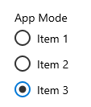
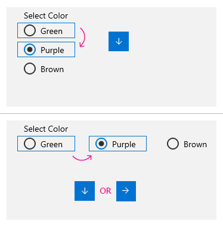
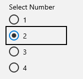

# Background
Radio buttons are used for mutually exclusive options in an app. When the user selects
one in a group, the previously-checked button is unchecked. Consequently, radio buttons
must be grouped, which is done with the Xaml [RadioButton](https://docs.microsoft.com/uwp/api/Windows.UI.Xaml.Controls.RadioButton)
control by setting the GroupName property on each button to the same value.

That mechanism is awkward, and doesn't by default give the right keyboarding or
accessibility behavior.

The RadioButtons control in this spec is introduced to help solve those issues.
It's like a ListView control, but the items in the list are RadioButton controls.

# Description

RadioButtons is a new control that enables you to create groups of RadioButton elements easily,
while also correctly supporting keyboarding and Narrator functionality.

# Examples

The following example demonstrates how to create a group of RadioButton elements
using the RadioButtons control.

```xaml
<muxc:RadioButtons Header="App Mode" SelectedIndex="2">
    <x:String>Item 1</x:String>
    <x:String>Item 2</x:String>
    <x:String>Item 3</x:String>         
</muxc:RadioButtons>
```



## DataBinding with RadioButtons
An example of simple data binding of the ItemsSource with RadioButtons.

```xaml
<muxc:RadioButtons Header="App Mode" ItemsSource="{x:Bind radioButtonItems}" />
```

```C#
public sealed partial class MainPage : Page
{
    public class OptionDataModel
    {
        public string Label;
        public override string ToString()
        {
            return Label;
        }
    }

    List<OptionDataModel> radioButtonItems;

    public MainPage()
    {
        this.InitializeComponent();

        radioButtonItems = new List<OptionDataModel>();
        radioButtonItems.Add(new OptionDataModel() { Label = "Item 1" });
        radioButtonItems.Add(new OptionDataModel() { Label = "Item 2" });
        radioButtonItems.Add(new OptionDataModel() { Label = "Item 3" });
    }
}
```

## Vertical and horizontal RadioButton lists
In instances where there is more that one column of RadioButton items within a single RadioButtons list control, the list will flow a column-major layout.

|MaxColumns not specified <br>OR<br> MaxColumns = 1 |  MaxColumns = 4 |
|:--:|:--:|
|  |  |

```xml
<RadioButtons Header="Select Number" MaxColumns="2">
    <x:String>1</x:String>
    <x:String>2</x:String>
    <x:String>3</x:String>
    <x:String>4</x:String>
</RadioButtons>
```

By default, the RadioButtons list will fill itself vertically, meaning if no ``MaxColumns`` value is set, it will be assumed to be 1 and orient itself vertically.

### Multiple columns (uncommon case)

If you specify a ``MaxColumns`` value that is not equal to the number of items in the RadioButtons list, the list will arrange  itself in column-major order and put any uneven/remaining items in the first column, in the case of an uneven ``MaxColumns`` value or list items defined.

|MaxColumns = 3|
|:--|
||

```xml
<RadioButtons Header="Select Number" MaxColumns="3">
    <x:String>1</x:String>
    <x:String>2</x:String>
    <x:String>3</x:String>
    <x:String>4</x:String>
    <x:String>5</x:String>
    <x:String>6</x:String>
    <x:String>7</x:String>
</RadioButtons>
```

# Remarks
The RadioButtons control has special navigation behavior that helps keyboard users navigate the list more quickly and more easily.

## Putting focus into the RadioButtons list
There are two states that the RadioButtons control can have with it's RadioButton content:

- A list of RadioButton controls where none are selected/checked
- A list of RadioButton controls where one is already selected/checked

The following two sections (below) cover the focus behavior when tabbing into the list in both cases outlined in the bullet list above.

### A RadioButton is selected
When a RadioButton is selected and the user tabs into the list, focus is put on the selected RadioButton.

|Focus is on button<br>RadioButton group does not have focus| Tab has been pressed<br>RadioButton group now has focus|
|:--:|:--:|
|  | |

### No RadioButton is selected
When no RadioButton controls are selected in the RadioButtons list, focus is put on the first RadioButton in the list.

> Note: The RadioButton that receives tab focus from this initial navigation will **not be selected/checked**.

|Focus is on button<br>RadioButton group does not have focus | Tab has been pressed<br>RadioButton group now has focus|
|:--:|:--:|
|  | |

## Keyboard navigation
When you have a single column list of RadioButton control options and you have already put focus onto an item, you can navigate the RadioButtons list in logical sequential order using the keyboard.

- The up or down arrow keys will move to the "next" or "previous" logical item (defined in markup)
- The left or right arrow keys will move spatially



This means that in purely vertical RadioButton group lists, left/right arrow keys will not do anything, but up/down will still navigate as expected. However, in purely horizontal RadioButton group lists, left and right will navigate the same way as up and down.

>This behavior is defined more below when we discuss multi-column RadioButton group lists.

### Keyboard navigation with multiple columns
The keyboarding behavior is the same as the single-column navigation, it just wraps to the next column when there is more than one defined.


## Selection follows focus
When you are navigating a RadioButtons list via the keyboard, as focus is placed on a previous or next RadioButton item, that item will also get selected/checked. This means the previous item that was selected/checked will be unselected, and the currently focused one will be instead.

|Before keyboard navigation | After keyboard navigation|
|:--|:--|
|  | |
| Focus is on the "2" RadioButton, and it is shown as selected | The down or right arrow key has been pressed, so focus was moved to the "3" RadioButton, thus selected 3 and unselected 2. |

### No Selection follows focus with gamepad
If you're navigating the RadioButtons container with a gamepad controller, the selection follows focus behavior will be disabled. When navigating a RadioButtons control, no gamepad engagement is necessary to initiate navigation or to select RadioButton elements within the group.

## Accessibility behavior

Below is a detailed table of, depending on the user interaction, what the narrator is expected to say.

|Upon *first* putting focus into the group | Navigating to a selected item |
|:--|:--|
| "Group name" RadioButton collection, x of N selected | RadioButton "name" selected, x of N |
|"Group name" RadioButton collection control, none selected| RadioButton "name" not selected, x of N <br> *(If navigating with shift-arrow keys, meaning no selection following focus)* |

## No Wrapping
The RadioButtons group does not wrap. This is because when using a screen reader, a sense of boundary and clear indication of ends versus beginnings is lost and thus making it difficult for blind users to navigate the list easily. There is also no enumeration with a RadioButtons group, since groups like this are meant to have a resonable number of items within.

If you find that you need wrapping behavior, perhaps a RadioButtons group isn't for you. Consider using a [ListView with multiple selection enabled](https://docs.microsoft.com/en-us/windows/uwp/design/controls-and-patterns/listview-and-gridview#item-selection-and-interaction).

# API Details

## API Notes

| Name | Description |
|:-|:--|
| Header | Places a label object above the group of RadioButton elements and is exposed to the UIA tree via the DataContext property on the RadioButtons control's ContentPresenter. |
| SelectedItem | Gets the content of the selected RadioButton item. Selection is denoted by that item's RadioButton icon being checked. |
| SelectedIndex | Gets or sets the selected RadioButton item by index. Selection is denoted by that item's RadioButton icon being checked.|
| Items | Gets or sets an object source within the RadioButtons group. All items placed within the RadioButtons control will be in the content of a generated RadioButton. |
| ItemsSource | Gets or sets an object source used to generate the content of the ItemsControl. |
| ItemTemplate | The template set on any generated RadioButton elements within the RadioButtons control. If the root of the ItemTemplate is a RadioButton it will be used as the generated container. |
| MaxColumns | Defines the number of columns used to determine the control's layout |
| ColumnMajorUniformToLargestGridLayout | To be defined. |

## RadioButtons IDL

``` c++
namespace MU_XC_NAMESPACE
{

  unsealed runtimeclass RadioButtons : Windows.UI.Xaml.Controls.Control
  {
    RadioButtons();

    Object ItemsSource;
    Windows.Foundation.Collections.IVector<Object> Items{ get; };
    Object ItemTemplate;

    Windows.UI.Xaml.UIElement ContainerFromIndex(Int32 index);

    Int32 SelectedIndex;
    Object SelectedItem{ get; };
    event Windows.UI.Xaml.Controls.SelectionChangedEventHandler SelectionChanged;

    Int32 MaxColumns;
    Object Header;

    static Windows.UI.Xaml.DependencyProperty ItemsSourceProperty{ get; };
    static Windows.UI.Xaml.DependencyProperty ItemsProperty{ get; };
    static Windows.UI.Xaml.DependencyProperty ItemTemplateProperty{ get; };
    static Windows.UI.Xaml.DependencyProperty SelectedIndexProperty{ get; };
    static Windows.UI.Xaml.DependencyProperty SelectedItemProperty{ get; };
    static Windows.UI.Xaml.DependencyProperty MaxColumnsProperty{ get; };
    static Windows.UI.Xaml.DependencyProperty HeaderProperty{ get; };
  }
}
```

## RadioButtons Primitives

``` c++
namespace MU_XCP_NAMESPACE
{
  unsealed runtimeclass RadioButtonsElementFactory : MU_XC_NAMESPACE.ElementFactory
  {
    RadioButtonsElementFactory();
  }

  unsealed runtimeclass ColumnMajorUniformToLargestGridLayout : MU_XC_NAMESPACE.NonVirtualizingLayout
  {
    ColumnMajorUniformToLargestGridLayout();

    Int32 MaxColumns{ get; set; };
    static Windows.UI.Xaml.DependencyProperty MaxColumnsProperty{ get; };

    Int32 ColumnSpacing{ get; set; };
    static Windows.UI.Xaml.DependencyProperty ColumnSpacingProperty{ get; };

    Int32 RowSpacing{ get; set; };
    static Windows.UI.Xaml.DependencyProperty RowSpacingProperty{ get; };
  }
}
```

## Default ControlTemplate

``` xml
<Style TargetType="local:RadioButtons" BasedOn="{StaticResource DefaultRadioButtonsStyle}" />

<Style x:Key="DefaultRadioButtonsStyle" TargetType="local:RadioButtons">
    <Setter Property="IsTabStop" Value="False" />
    <Setter Property="TabNavigation" Value="Once" />
    <Setter Property="Template">
        <Setter.Value>
            <ControlTemplate TargetType="local:RadioButtons">
                <StackPanel>
                    <ContentPresenter Content="{TemplateBinding Header}"/>
                    <local:ItemsRepeater x:Name="InnerRepeater" ItemTemplate="{TemplateBinding ItemTemplate}">
                        <local:ItemsRepeater.Layout>
                            <primitives:ColumnMajorUniformToLargestGridLayout ColumnSpacing="7" RowSpacing="3"/>
                        </local:ItemsRepeater.Layout>
                    </local:ItemsRepeater>
                </StackPanel>
                </ControlTemplate>
        </Setter.Value>
    </Setter>
</Style>
```
